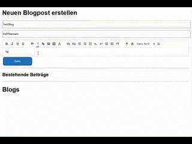

# Blazor Quill Editor
Blazor Quill Editor Class Library



## Blazor Quill Editor Features:
* Bilder per Drag & Drop, Paste oder Dateiauswahl einfügen
* Automatisches Resizing von Bildern beim Einfügen
* Base64- oder File-Upload-Modus wählbar

## SimpleBlog mit Blazor Quill Editor
Dies ist ein Beispielprojekt für einen einfachen Blog mit Blazor Server.
Es nutzt:

Quill Editor für die Texteingabe (mit Bild-Upload / Drag & Drop / Paste Support)

API-Backend zum Speichern und Laden von Blogposts


### Base64 oder File Upload
Per default ist in der ***quill.initialize.js*** die Option Base64 auf true eingestellt, so das die
Bilder als Base64 eingebettet werden.
Wenn ihr einen File-Upload möchtet, solltet ihr den Pfad entsprechend eurer Struktur einstellen. 
Der Default Pfad zeigt auf : ***/api/upload***.
Ggf. sollte auch eine Authentifizierung implementieren werden.

## Usage
Kopiert die Klassenbibliothek in eurer Projekt und fügt den QuillEditor zu eurer Projektmappe und eurem Projekt hinzu.

Wenn ihr die Base64 Einstellung beibehaltet, solltet ihr die MaximumReceiveMessageSize entspechend erhöhen:

Programm.cs
```
builder.Services.AddServerSideBlazor()
    // Die default Receive Size ist 32KB. Das führt zu Problemen beim speichern der
    // Einträge wenn Bilder als Base64 enthalten sind!
    .AddHubOptions(options =>
    {
        options.MaximumReceiveMessageSize = 10 * 1024 * 1024; // 10 MB 
    });
```

Imports
```
@using QuillEditor
```

YourAdminPage.razor
```
<QuillEditorBox @ref="editor" MaxImageWidth="400" MaxImageHeight="400" />
```
MaxImageWidth und MaxImageHeight sind Optional. 
Hiermit wird direkt beim Einfügen die Bildgröße auf die jeweilige Maximalangabe skaliert, 
so dass die Images tatsächlich auch in der Dateigröße sich verkleinern. 

## Hinweis
Damit die Classes die Quill im HTML zurückgibt auch auf eurer Ausgabeseite übernommen werden, 
muss sich der HTML Content in folgender Struktur befinden:

_Host.cshtml
```
<link href="./_content/uxBlazorQuillEditor/css/quilleditor.css" rel="stylesheet" />
```

YourBlogPage.razor
```
<div class="ql-snow">
    <!-- Um den Stylesheet von quill zu übernehmen!! -->
    <div class="ql-editor">
        <!-- Um den Stylesheet von quill zu übernehmen!! -->
                
        @((MarkupString)post.HtmlContent)
    </div>
</div>
```

---
### Verwendete Quellen und für offline Benutzung integriert:
Quill Resize Module v2.0.3
```
File: quill.resize.js
File: quill.resize.css
```

 * https://github.com/mudoo/quill-resize-module
 * The MIT License
 * Copyright © 2018


Quill Module v2.0.3
```
File: quill.js
File: quill.snow.css
```

 * https://quilljs.com/
 * https://github.com/slab/quill
 * Copyright (c) 2017-2024, Slab
 * Copyright (c) 2014, Jason Chen
 * Copyright (c) 2013, salesforce.com
 * All rights reserved.